# [Icarus](https://github.com/kehessen/Icarus/releases/latest)

A Minecraft Plugin focused on adding aerial and military-inspired combat mechanics.\
There is a resource pack which adds custom sounds, but the plugin will
work perfectly fine without it.

You can either host it yourself or add the following into your server.properties file:
> resource-pack=https\://raw.githubusercontent.com/kehessen/Icarus/main/resourcepacks/Icarus.Soundpack.zip \
> resource-pack-sha1=31b29df6a50e4c694452377bde0355e348b12042

Some crafting recipes are available from the start, others are discovered by crafting / obtaining certain items.\
The **entity-activation-range for misc** has to be set at least to the turret range for the turret shots to look good,
otherwise the
arrows will start to group up instead of constantly firing.\
(this should get detected and changed automatically, but it's better to do it yourself to prevent any issues)

_Many features are configurable in the config.yml file._

### Quality of Life features

- `/spawn`, `/tpa`
- Spawn can be set with `/spawn set`

### Teams

- You can join teams by using `/join [teamName]`
- Any player in the team can accept or deny join requests
- By default, all players are in the "Default" team
- Teams have to be created by operators using `/team add [teamName]` and the first player has to be added using
  `/team join [teamName] [playerName]`
- There will be "random" UUIDs in the team list, these belong to the turrets as they can only be used by the team that
  created them

### Bases

- Every team can have one base
- Teleport to your base by using `/base`
- Bombs and Airstrikes will (by default) not explode in bases (Napalm will still work)
- Creepers will not explode in bases\
  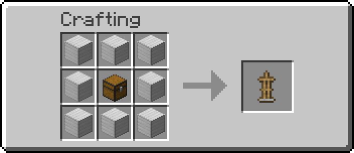

### Bombs

- Craft 50kg, 100kg and Hydrogen Bombs to attack enemy teams in the air
- Ammonium Nitrate and Plutonium cores can be dropped by creepers when killed by a player without using looting
- Ammonium Nitrate has a 5% chance to drop; the Plutonium Core has a .5% chance to drop (drop disabled for creeper
  farms)
- Can be used against enemy bases or turrets
- 50kg bomb crafting recipe (normal TNT):\
  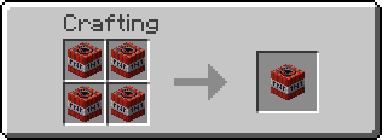
- 100kg bomb crafting recipe (normal TNT and Ammonium Nitrate):\
  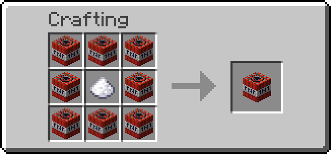
- Hydrogen bomb crafting recipe (50kg Bombs and Plutonium core):\
  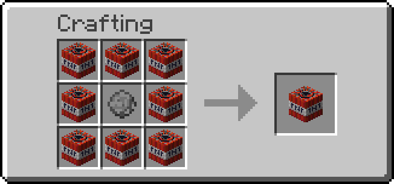
- It is generally suggested not to craft Hydrogen Bombs in your base, as something might happen rarely

### Turrets

- Craft turrets to defend against enemy bombers and other aerial attackers
- The required ender pearl can be dropped by Endermen without using looting
- Right-click the turret to add ammo, activate / deactivate it or change the shot delay\
  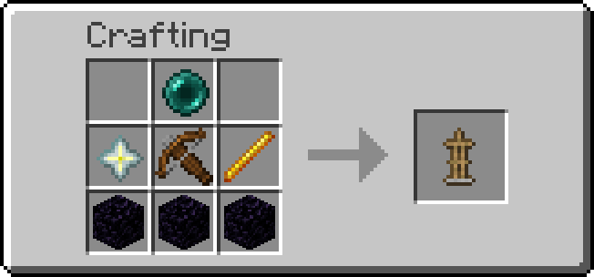

### Flares

- Can be used to distract turrets for 2.5 seconds\
  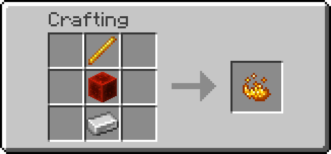

### Rocket Launchers

- Can be used to explode dropped bombs before they reach the ground\
  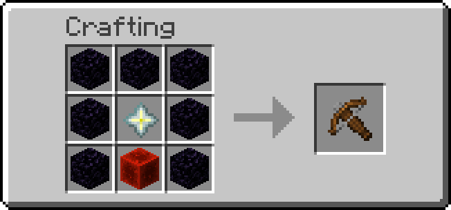
- Ammo crafting recipe:\
  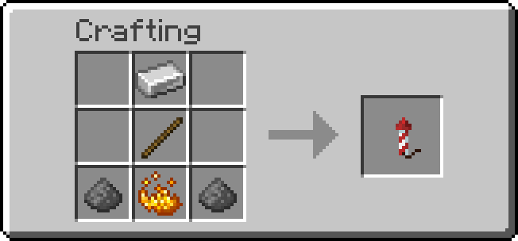

### MANPADs (Man-portable air-defense systems)

- Can be used to shoot down enemies in the air\
  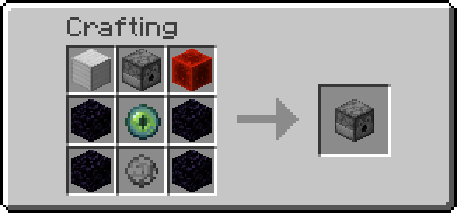
- Missile crafting recipe:\
  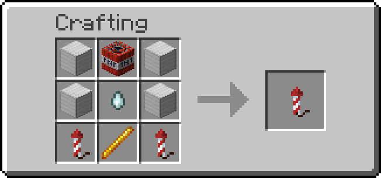

### Airstrikes

- Call an airstrike on the marked location
- Crafting recipe:\
  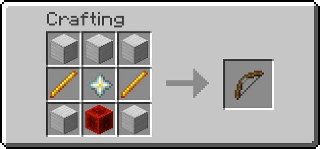

### Napalm

- Use napalm to burn down enemy bases\
  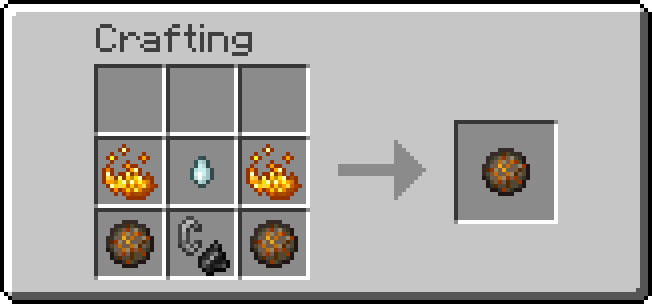

### Player Mounting

- Mount on a player's back while they are flying to act as their gunman (shift + right click)
- shoot with a M2 Browning
- don't forget to craft ammo before entering a fight
- Ammo recipe:\
  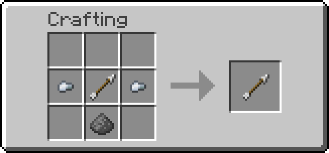

### Smoke Grenades

- self-explanatory, will give all entities in radius blindness and invisibility for 2.5 seconds\
  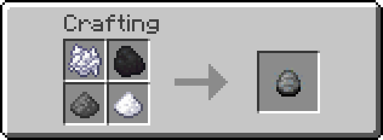

### Planned Features

- stationary bomb defense
- possibly guided rocket launcher (mainly against bombs as well)
- use sulfur cubes for some missiles/bombs?