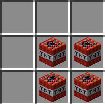
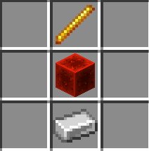

# [Icarus](https://github.com/kehessen/Icarus/releases/latest)

A Minecraft Plugin focused on adding some combat mechanics.\
There is a resource pack which adds custom sounds (fow now just the lock-on sound for the turret), but the plugin will
work perfectly fine without it.

Some crafting recipes are available from the start, others are discovered by crafting / obtaining certain items.
\
The **entity-activation-range for misc** has to be set to ~160–200 for the turret shots to look good, otherwise the
arrows will start to group up instead of constantly firing.

_Many features are configurable in the config.yml file._

### TPA and Spawn

- Quality-of-life features such as _**/spawn**_ or _**/tpa**_
- Spawn can be set with **_/spawn set_**

### Teams

- You can join teams by using _/join [teamName]_
- Any player in the team can accept or deny join requests
- Teams have to be created by operators using _**/team add [teamName]**_ and the first player has to be added using _**/team
  join [teamName] [playerName]**_
- There will be "random" UUIDs in the team list, these belong to the turrets as they can only be used by the team that
  created them

### Bombs

- Craft 50kg, 100kg and Hydrogen Bombs to attack enemy teams in the air
- Ammonium Nitrate and Plutonium cores can be dropped by creepers when killed by a player without using looting
- Ammonium Nitrate has a 5% chance to drop; the Plutonium Core has a .5% chance to drop
- Can be used against enemy bases or turrets
- 50kg bomb crafting recipe (normal TNT): \
  
- 100kg bomb crafting recipe (normal TNT and Ammonium Nitrate): \
  
- Hydrogen bomb crafting recipe (100kg Bombs and Plutonium core): \
  
- It is generally suggested not to craft Hydrogen Bombs in your base, as something might happen rarely

### Turrets

- craft turrets to defend against enemy bombers and other aerial attackers
- the required ender pearl can be dropped by Endermen without using looting
- right-click the turret to add ammo, activate / deactivate it or change the shot delay
- Crafting recipe: \
  

### Flares

- Can be used to distract turrets for 2.5 seconds
- Crafting recipe: \
  

### Rocket Launchers

- Can be used to explode dropped bombs before they reach the ground
- Crafting recipe:\
  
- don't forget to craft ammo, or your team will be mad
- Ammo crafting recipe: \
  

### Airstrikes

- Call an airstrike on the marked location
- Crafting recipe: \

### Player Mounting

- Mount on a player's back while they are flying to act as their gunman
- shoot with a M2 Browning
- don't forget to craft ammo before entering a fight
- Ammo recipe:   
  

### Smoke Grenades

- self-explanatory, will give all entities in radius blindness and invisibility for 2.5 seconds
- Crafting recipe: \
  