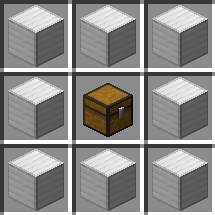
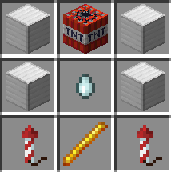

# [Icarus](https://github.com/kehessen/Icarus/releases/latest)

A Minecraft Plugin focused on adding aerial and military-inspired combat mechanics.\
There is a resource pack which adds custom sounds, but the plugin will
work perfectly fine without it.

You can either host it yourself or add the following into your server.properties file:
> resource-pack=https://download.mc-packs.net/pack/25d3811d7798c58a542542c8d1159a38124633e0.zip \
> resource-pack-sha1=25d3811d7798c58a542542c8d1159a38124633e0

Some crafting recipes are available from the start, others are discovered by crafting / obtaining certain items.
\
The **entity-activation-range for misc** has to be set at least to the turret range for the turret shots to look good, otherwise the
arrows will start to group up instead of constantly firing.

_Many features are configurable in the config.yml file._

### Quality of Life features

- _**/spawn**_, _**/tpa**_
- Spawn can be set with **_/spawn set_**

### Teams

- You can join teams by using _/join [teamName]_
- Any player in the team can accept or deny join requests
- By default, all players are in the "Default" team
- Teams have to be created by operators using _**/team add [teamName]**_ and the first player has to be added using
  _**/team
  join [teamName] [playerName]**_
- There will be "random" UUIDs in the team list, these belong to the turrets as they can only be used by the team that
  created them

### Bases

- Every team can have one base
- Teleport to your base by using _**/base**_
- Bombs and Airstrikes will (by default) not explode in bases (Napalm will still work)
- Creepers will not explode in bases
- Crafting recipe: \
  

### Bombs

- Craft 50kg, 100kg and Hydrogen Bombs to attack enemy teams in the air
- Ammonium Nitrate and Plutonium cores can be dropped by creepers when killed by a player without using looting
- Ammonium Nitrate has a 5% chance to drop; the Plutonium Core has a .5% chance to drop (drop disabled for creeper
  farms)
- Can be used against enemy bases or turrets
- 50kg bomb crafting recipe (normal TNT): \
  
- 100kg bomb crafting recipe (normal TNT and Ammonium Nitrate): \
  
- Hydrogen bomb crafting recipe (50kg Bombs and Plutonium core): \
  
- It is generally suggested not to craft Hydrogen Bombs in your base, as something might happen rarely

### Turrets

- craft turrets to defend against enemy bombers and other aerial attackers
- the required ender pearl can be dropped by Endermen without using looting
- right-click the turret to add ammo, activate / deactivate it or change the shot delay
- Crafting recipe: \
  

### Flares

- Can be used to distract turrets for 2.5 seconds
- Crafting recipe: \
  

### Rocket Launchers

- Can be used to explode dropped bombs before they reach the ground
- Crafting recipe:\
  
- Ammo crafting recipe: \
  

### MANPADs (Man-portable air-defense systems)

- Can be used to shoot down enemies in the air
- Crafting recipe: \
  
- Ammo crafting recipe: \
  

### Airstrikes

- Call an airstrike on the marked location
- Crafting recipe: \
  

### Napalm

- Use napalm to burn down enemy bases
- Crafting recipe: \
  

### Player Mounting

- Mount on a player's back while they are flying to act as their gunman (shift + right click)
- shoot with a M2 Browning
- don't forget to craft ammo before entering a fight
- Ammo recipe:   
  

### Smoke Grenades

- self-explanatory, will give all entities in radius blindness and invisibility for 2.5 seconds
- Crafting recipe: \
  

### Planned Features

- stationary bomb defense
- possibly guided rocket launcher (mainly against bombs as well)